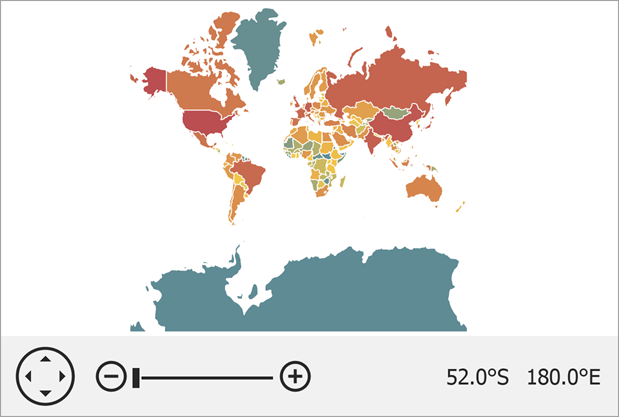

<!-- default badges list -->

<!-- default badges end -->

# Map for WinForms - Load SVG file Content to the Map Control

This example demonstrates how to load SVG file content to the Map Control.

To do this, follow the steps below:

* Create a [VectorItemsLayer](https://docs.devexpress.com/WindowsForms/DevExpress.XtraMap.VectorItemsLayer) and add it to the [MapControl.Layers](https://docs.devexpress.com/WindowsForms/DevExpress.XtraMap.MapControl.Layers?p=netframework) collection.
* Initialize the [VectorItemsLayer.Data](https://docs.devexpress.com/WindowsForms/DevExpress.XtraMap.VectorItemsLayer.Data) property with an [SvgFileDataAdapter](https://docs.devexpress.com/WindowsForms/DevExpress.XtraMap.SvgFileDataAdapter?p=netframework) object.
* To specify the path to an SVG file, use the adapter's [SvgFileDataAdapter.FileUri](https://docs.devexpress.com/WindowsForms/DevExpress.XtraMap.SvgFileDataAdapter.FileUri) property.

## Files to Look At

* [Form1.cs](./CS/SvgDataAdapterSample/Form1.cs) (VB: [Form1.vb](./VB/SvgDataAdapterSample/Form1.vb))

## Documentation

* [SvgFileDataAdapter](https://docs.devexpress.com/WindowsForms/DevExpress.XtraMap.SvgFileDataAdapter?p=netframework)
* [Vector Items](https://docs.devexpress.com/WindowsForms/15091/controls-and-libraries/map-control/vector-data/vector-items?p=netframework)

## More Examples

* [How to Create Map Items Based on Data From an XML File](https://github.com/DevExpress-Examples/winforms-map-bind-to-xml-data)
* [How to load data from a KML file](https://github.com/DevExpress-Examples/how-to-load-data-from-a-kml-file-t140303)
* [How to load data from a SQL geometry data-source](https://github.com/DevExpress-Examples/how-to-load-data-from-a-sql-geometry-data-source-t175898)
* [How to customize mini map layers](https://github.com/DevExpress-Examples/how-to-customize-mini-map-layers-t201418)
